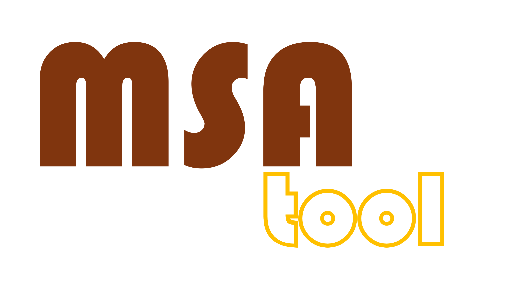

# Project name

Short description of the project. Use gifs to illustrate how it works.

Contents
========

 * [Limitations](#limitations)
 * [Dependencies](#dependencies)
 * [Installation](#installation)
 * [Usage](#usage)
 * [Referencing](#referencing)
 * [Contact](#contact)
 * [License](#license)

## Limitations

What it can not do? What shall be improved? Any assumptions?

## Dependencies

What other tools the project is using

## Installation

How to install?

## Usage

How to use? Any examples?

## Referencing

Please refer to the code and data by citing the paper:

## Contact

Provide email address of the best contact person.

## License
Copyright 2025 SASPLab

Permission is hereby granted, free of charge, to any person obtaining a copy of this software and associated documentation files (the “Software”), to deal in the Software without restriction, including without limitation the rights to use, copy, modify, merge, publish, distribute, sublicense, and/or sell copies of the Software, and to permit persons to whom the Software is furnished to do so, subject to the following conditions:

The above copyright notice and this permission notice shall be included in all copies or substantial portions of the Software.

THE SOFTWARE IS PROVIDED “AS IS”, WITHOUT WARRANTY OF ANY KIND, EXPRESS OR IMPLIED, INCLUDING BUT NOT LIMITED TO THE WARRANTIES OF MERCHANTABILITY, FITNESS FOR A PARTICULAR PURPOSE AND NONINFRINGEMENT. IN NO EVENT SHALL THE AUTHORS OR COPYRIGHT HOLDERS BE LIABLE FOR ANY CLAIM, DAMAGES OR OTHER LIABILITY, WHETHER IN AN ACTION OF CONTRACT, TORT OR OTHERWISE, ARISING FROM, OUT OF OR IN CONNECTION WITH THE SOFTWARE OR THE USE OR OTHER DEALINGS IN THE SOFTWARE.

